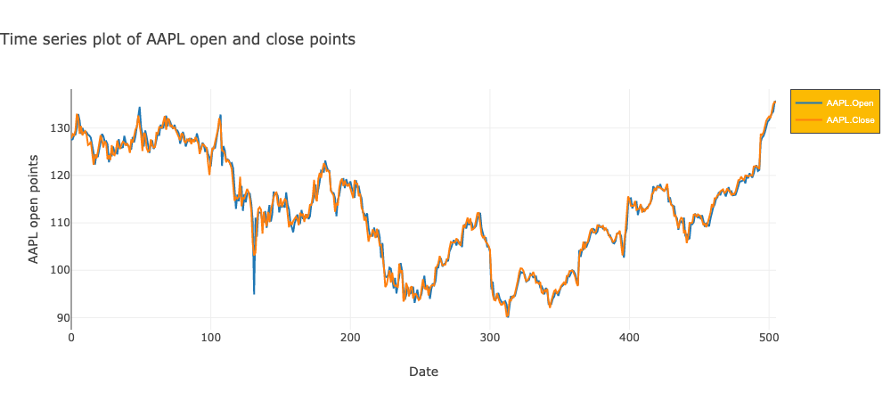

# Configuring your plots

danfo.js plotting uses [Plotly.js](https://plotly.com/javascript) as its backend for plotting. This means you have all the configuration, flexibility and interactiveness of Plotly. 

All [customization](https://plotly.com/javascript/line-charts/) on the plot can be passed as an object of key-value pairs to the config parameter. For example, in the line plot below, we define a layout for our plot and give it a name. 

For example in the following code, we show how to set some basic configuration as well as layout for a line plot. 

```markup
<!doctype html>
<html>

<head>
    <script src="https://cdn.plot.ly/plotly-latest.min.js"></script>
    <script src="https://cdn.jsdelivr.net/npm/danfojs@0.3.3/lib/bundle.min.js"></script>

</head>

<body>

    <div id="mydiv"></div>
    <script>

        dfd.read_csv("https://raw.githubusercontent.com/plotly/datasets/master/finance-charts-apple.csv")
            .then(df => {


                var layout = {
                    title: {
                        text: "Time series plot of AAPL open and close points",
                        x: 0
                    },
                    legend: {
                        bgcolor: "#fcba03",
                        bordercolor: "#444",
                        borderwidth: 1,
                        font: { family: "Arial", size: 10, color: "#fff" }
                    },
                    width: 1000,
                    yaxis: {
                        title: 'AAPL open points',
                    },
                    xaxis: {
                        title: 'Date',
                    }
                }
                var config = {
                    columns: ["AAPL.Open", "AAPL.Close"], //columns to plot
                    displayModeBar: true,
                    modeBarButtonsToAdd: [{ //Add custom button
                        name: 'about',
                        icon: Plotly.Icons.question,
                        click: function (gd) {
                            alert('An example of configuring Danfojs Plots')
                        }
                    }],
                    layout //layout object
                }

                df.plot("mydiv").line(config)
            })
    </script>
</body>

</html>
```



