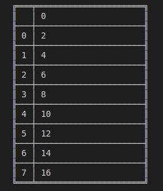
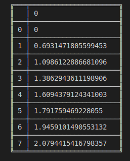
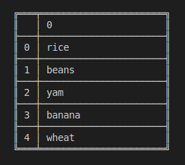

# danfo.Series.apply

> danfo.series.**apply**\(callable\) \[[source](https://github.com/opensource9ja/danfojs/blob/master/danfojs/src/core/series.js#L718)\]

| Parameters | Type | Description | Default |
| :--- | :--- | :--- | :--- |
| callable | Function | Function \(can be anonymous\) to apply |  |

**Returns:**

       ****return **Series**

\*\*\*\*

**Example**

```javascript
const dfd = require("danfojs")

let sf = new dfd.Series([1, 2, 3, 4, 5, 6, 7, 8])

let apply_func = (x) => {
    return x + x
}
sf.apply(apply_func).print()
```

**OUTPUT:**



```javascript
const dfd = require("danfojs")

let sf = new dfd.Series([1, 2, 3, 4, 5, 6, 7, 8])

sf.apply(Math.log).print()
```

**OUTPUT:**



```javascript
const dfd = require("danfojs")

let sf = new dfd.Series(["Rice","Beans","Yam","Banana","Wheat"])

sf.apply((x)=>{
    return x.toLocaleLowerCase()
}).print()
```

**OUTPUT**




