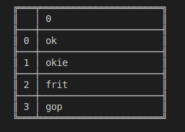
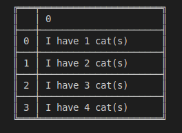

# danfo.Series.map

> danfo.series.**map**\(callable\) \[[source](https://github.com/opensource9ja/danfojs/blob/master/danfojs/src/core/series.js#L685)\]

| Parameter | Type | Description | Default |
| :--- | :--- | :--- | :--- |
| callable | Function or Object | callable can either be a function or an object\({}\) |  |

**Example**

```javascript
const dfd = require("danfojs")

let sf = new dfd.Series([1,2,3,4])
let map = { 1: "ok", 2: "okie", 3: "frit", 4: "gop" }
sf.map(map)

```

**OUTPUT**



```javascript
const dfd = require("danfojs")

let sf = new dfd.Series([1,2,3,4])

sf.map((x)=>{
    return `I have ${x} cat(s)`
}).print()

```

**OUTPUT**



