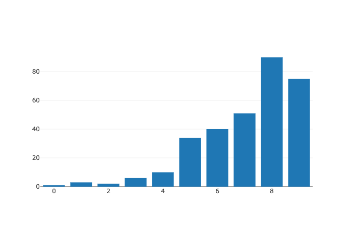

# Bar Charts

A bar plot presents categorical data with rectangular bars with lengths proportional to the values that they represent.

## Examples

### Bar plot on Series

```markup
<!DOCTYPE html>
<html lang="en">

<head>
    <meta charset="UTF-8">
    <meta name="viewport" content="width=device-width, initial-scale=1.0">
     <script src="https://cdn.jsdelivr.net/npm/danfojs@1.2.0/lib/bundle.min.js"></script>
    <title>Document</title>
</head>

<body>

    <div id="plot_div"></div>
    <script>

        const s = new dfd.Series([1, 3, 2, 6, 10, 34, 40, 51, 90, 75])
        s.plot("plot_div").bar()

    </script>
</body>

</html>
```



### Bar plot on DataFrame

```markup
<!DOCTYPE html>
<html lang="en">

<head>
    <meta charset="UTF-8">
    <meta name="viewport" content="width=device-width, initial-scale=1.0">
     <script src="https://cdn.jsdelivr.net/npm/danfojs@1.2.0/lib/bundle.min.js"></script>
</head>

<body>

    <div id="plot_div"></div>
    <script>

        const df = new dfd.DataFrame({'pig': [20, 18, 489, 675, 1776],
                               'horse': [4, 25, 281, 600, 1900]}, {index: [1990, 1997, 2003, 2009, 2014]})
        df.plot("plot_div").bar()

    </script>
</body>

</html>
```



To customize plots, see the [Customizing your plot page](configuring-your-plots.md)

