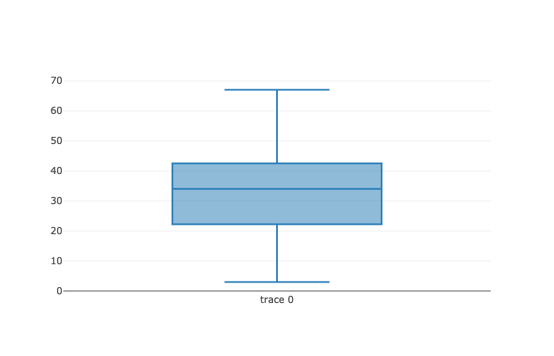

# Box Plots

Make a box-and-whisker plot from DataFrame columns, optionally grouped by some other columns. A box plot is a method for graphically depicting groups of numerical data through their quartiles.

## Examples

### Boxplot for a Series Object




```tsx
import { useEffect } from 'react';
import './App.css';
import { Series } from "danfojs-nightly";

function App() {

  useEffect(() => {
    const s = new Series([20, 30, 40, 23, 40, 3, 50, 34, 67]);
    s.plot("plot_div").box();
  }, [])

  return (
    <div className="App">
      <header className="App-header">
        <div id="plot_div"></div>
      </header>
    </div>
  );
}

export default App;
```




```html
<!DOCTYPE html>
<html lang="en">
  <head>
    <meta charset="UTF-8" />
    <meta name="viewport" content="width=device-width, initial-scale=1.0" />
    <script src="https://cdn.jsdelivr.net/npm/danfojs-nightly@1.0.2/lib/bundle.js"></script>
    <title>Document</title>
  </head>

  <body>
    <div id="plot_div"></div>

    <div id="plot_div"></div>
    <script>
      const s = new dfd.Series([20, 30, 40, 23, 40, 3, 50, 34, 67]);
      s.plot("plot_div").box();
    </script>
  </body>
</html>
```





### Box plots on a DataFrame




```tsx
import { useEffect } from 'react';
import './App.css';
import { Series, readCSV } from "danfojs-nightly";

function App() {

  useEffect(() => {
    readCSV("https://raw.githubusercontent.com/pandas-dev/pandas/master/doc/data/titanic.csv")
      .then(df => {

        const sub_df = df.loc({ columns: ["Age", "Fare"] })
        sub_df.plot("plot_div").box()

      }).catch(err => {
        console.log(err);
      })
  }, [])

  return (
    <div className="App">
      <header className="App-header">
        <div id="plot_div"></div>
      </header>
    </div>
  );
}

export default App;
```




```html
<!DOCTYPE html>
<html lang="en">
  <head>
    <meta charset="UTF-8" />
    <meta name="viewport" content="width=device-width, initial-scale=1.0" />
    <script src="https://cdn.jsdelivr.net/npm/danfojs-nightly@1.0.2/lib/bundle.js"></script>
    <title>Document</title>
  </head>

  <body>
    <div id="plot_div"></div>

    <div id="plot_div"></div>
    <script>
      dfd
        .readCSV(
          "https://raw.githubusercontent.com/pandas-dev/pandas/master/doc/data/titanic.csv"
        )
        .then((df) => {
          const sub_df = df.loc({ columns: ["Age", "Fare"] });
          sub_df.plot("plot_div").box();
        })
        .catch((err) => {
          console.log(err);
        });
    </script>
  </body>
</html>
```



 (1).png>)

### Box plot for selected columns in a DataFrame




```tsx
import { useEffect } from 'react';
import './App.css';
import { Series, readCSV } from "danfojs-nightly";

function App() {

  useEffect(() => {
    readCSV("https://raw.githubusercontent.com/pandas-dev/pandas/master/doc/data/titanic.csv")
      .then(df => {

        df.plot("plot_div").box({
          config: {
            x: "Survived", y: "Age"
          },
          layout: {
            title: "Box Plot"
          }
        })
      }).catch(err => {
        console.log(err);
      })
  }, [])

  return (
    <div className="App">
      <header className="App-header">
        <div id="plot_div"></div>
      </header>
    </div>
  );
}

export default App;
```




```html
<!DOCTYPE html>
<html lang="en">
  <head>
    <meta charset="UTF-8" />
    <meta name="viewport" content="width=device-width, initial-scale=1.0" />
    <script src="https://cdn.jsdelivr.net/npm/danfojs-nightly@1.0.2/lib/bundle.js"></script>
    <title>Document</title>
  </head>

  <body>
    <div id="plot_div"></div>

    <div id="plot_div"></div>
    <script>
      dfd
        .readCSV(
          "https://raw.githubusercontent.com/pandas-dev/pandas/master/doc/data/titanic.csv"
        )
        .then((df) => {
          df.plot("plot_div").box({ config: { x: "Survived", y: "Age" } });
        })
        .catch((err) => {
          console.log(err);
        });
    </script>
  </body>
</html>
```



.png>)


To customize your plots, see the [Configuring your plot page](configuring-your-plots.md)

