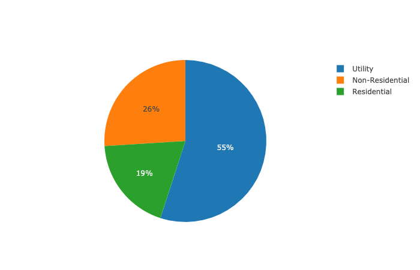

# Pie Charts

A pie plot is a proportional representation of the numerical data in a column

## Examples

### Pie Chart from Columns in a DataFrame

```markup
<!DOCTYPE html>
<html lang="en">

<head>
    <meta charset="UTF-8">
    <meta name="viewport" content="width=device-width, initial-scale=1.0">
     <!--danfojs CDN -->
    <script src="https://cdn.jsdelivr.net/gh/opensource9ja/danfojs@latest/lib/bundle.js"></script>
    <title>Document</title>
</head>

<body>

    <div id="plot_div"></div>
    <script>

         df = new dfd.DataFrame({
            Price: [19, 26, 55],
            Location: ["NG", "GH", "SA"],
            Type: ['Residential', 'Non-Residential', 'Utility']
        })
        
        df.plot("plot_div").pie({ values: "Price", labels: "Type" })

    </script>
</body>

</html>

```



### Multiple Pie Chart from Columns in a DataFrame

```markup
<!DOCTYPE html>
<html lang="en">

<head>
    <meta charset="UTF-8">
    <meta name="viewport" content="width=device-width, initial-scale=1.0">
     <!--danfojs CDN -->
    <script src="https://cdn.jsdelivr.net/gh/opensource9ja/danfojs@latest/lib/bundle.js"></script>
    <title>Document</title>
</head>

<body>

    <div id="plot_div"></div>
    <script>

       df = new dfd.DataFrame({
            Price: [19, 26, 55],
            Count: [20, 50, 25],
            Type: ['Residential', 'Non-Residential', 'Utility']
        })

        df.plot("plot_div").pie({ labels: "Type"})


    </script>
</body>

</html>

```


### Configure Position of Pie Charts

If you have more than one pie charts displayed, you can set the grid parameter, and also the position of each pie. For example, in the snippet below, we set our grid to 2 by 2 and also pass a set of row and column index position. Each row/column position index correspond to each pie. 

```markup
<!DOCTYPE html>
<html lang="en">

<head>
    <meta charset="UTF-8">
    <meta name="viewport" content="width=device-width, initial-scale=1.0">
     <!--danfojs CDN -->
    <script src="https://cdn.jsdelivr.net/gh/opensource9ja/danfojs@latest/lib/bundle.js"></script>
    <title>Document</title>
</head>

<body>

    <div id="plot_div"></div>
    <script>

       df = new dfd.DataFrame({
            Price: [19, 26, 55],
            Count: [20, 50, 25],
            Type: ['Residential', 'Non-Residential', 'Utility']
        })

       df.plot("plot_div").pie({ labels: "Type",
                                 grid: { rows: 2, columns: 2 },
                                 row_pos: [0, 1], col_pos: [0, 1] })

    </script>
</body>

</html>

```



For more configuration options for Pie Charts, see the [Plotly](https://plotly.com/javascript/pie-charts/) style doc.


