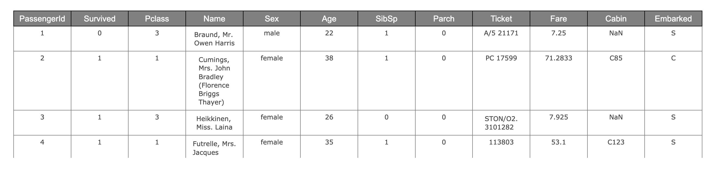

# Tables

## Examples

### Create Interactive Tables from DataFrame

```markup
<!DOCTYPE html>
<html lang="en">

<head>
    <meta charset="UTF-8">
    <meta name="viewport" content="width=device-width, initial-scale=1.0">
    <script src="https://cdn.jsdelivr.net/npm/danfojs@0.0.15/dist/index.min.js"></script>
    <title>Document</title>
</head>

<body>

    <div id="plot_div"></div>
    <script>

        

        dfd.read_csv("https://raw.githubusercontent.com/pandas-dev/pandas/master/doc/data/titanic.csv")
            .then(df => {
            
                df.plot("plot_div").table()
              
              
            }).catch(err => {
                console.log(err);
            })

    </script>
</body>

</html>
```


### Configure the header and cell of a table

To configure the header and cell of a table, you can pass header/cell styles to the **header\_style** and **cell\_style** parameter. The [Plotly table](https://plotly.com/javascript/table/) doc shows numerous configuration options you can pass. 

```markup
<!DOCTYPE html>
<html lang="en">

<head>
    <meta charset="UTF-8">
    <meta name="viewport" content="width=device-width, initial-scale=1.0">
    <script src="https://cdn.jsdelivr.net/npm/danfojs@0.0.15/dist/index.min.js"></script>
    <title>Document</title>
</head>

<body>

    <div id="plot_div"></div>
    <script>

        dfd.read_csv("https://raw.githubusercontent.com/pandas-dev/pandas/master/doc/data/titanic.csv")
            .then(df => {

                header_style = {
                    align: "center",
                    fill: { color: ['gray'] },
                    font: { family: "Arial", size: 15, color: "white" }
                }
                cell_style = {
                    align: ["center"],
                    line: { color: "black", width: 1 }
                }

                df.plot("plot_div").table({ header_style: header_style, cell_style: cell_style })

            }).catch(err => {
                console.log(err);
            })

    </script>
</body>

</html>


```



