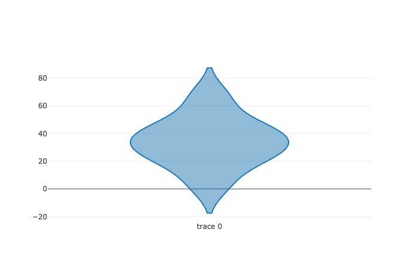

# Violin Plots

Make a violin plot from DataFrame columns, optionally grouped by some other columns. A violin plot is a method for graphically depicting groups of numerical data through their quartiles. See also [Box Plot](box-plots.md)

## Examples

### Boxplot for a Series Object

```markup
<!DOCTYPE html>
<html lang="en">

<head>
    <meta charset="UTF-8">
    <meta name="viewport" content="width=device-width, initial-scale=1.0">
    <script src="https://cdn.plot.ly/plotly-1.2.0.min.js"></script> 
     <script src="https://cdn.jsdelivr.net/npm/danfojs@0.3.3/lib/bundle.min.js"></script>
    <title>Document</title>
</head>

<body>

    <div id="plot_div"></div>
    <script>

        s = new dfd.Series([20, 30, 40, 23, 40, 3, 50, 34, 67])
        s.plot("plot_div").violin()
         
    </script>
</body>

</html>

```



### Box plots on a DataFrame

```markup
<!DOCTYPE html>
<html lang="en">

<head>
    <meta charset="UTF-8">
    <meta name="viewport" content="width=device-width, initial-scale=1.0">
    <script src="https://cdn.plot.ly/plotly-1.2.0.min.js"></script> 
     <script src="https://cdn.jsdelivr.net/npm/danfojs@0.3.3/lib/bundle.min.js"></script>
    <title>Document</title>
</head>

<body>

    <div id="plot_div"></div>
    <script>

          dfd.read_csv("https://raw.githubusercontent.com/pandas-dev/pandas/master/doc/data/titanic.csv")
            .then(df => {

                sub_df = df.loc({ columns: ["Age", "Fare"] })
                sub_df.plot("plot_div").violin()

            }).catch(err => {
                console.log(err);
            })

    </script>
</body>

</html>

```


### Box plot for selected columns in a DataFrame

```markup
<!DOCTYPE html>
<html lang="en">

<head>
    <meta charset="UTF-8">
    <meta name="viewport" content="width=device-width, initial-scale=1.0">
    <script src="https://cdn.plot.ly/plotly-1.2.0.min.js"></script> 
     <script src="https://cdn.jsdelivr.net/npm/danfojs@0.3.3/lib/bundle.min.js"></script>
    <title>Document</title>
</head>

<body>

    <div id="plot_div"></div>
    <script>

         dfd.read_csv("https://raw.githubusercontent.com/pandas-dev/pandas/master/doc/data/titanic.csv")
            .then(df => {

                df.plot("plot_div").violin({x: "Survived", y: "Age"})

            }).catch(err => {
                console.log(err);
            })

    </script>
</body>

</html>

```



To set configuration for your plots, see the [Configuring your plot page](configuring-your-plots.md)


