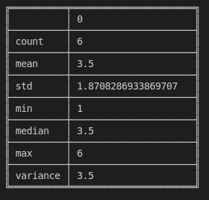

# Series.describe

> danfo.Series.describe\(\) \[[source](https://github.com/opensource9ja/danfojs/blob/master/danfojs/src/core/series.js#L583)\]

**Parameters:** No parameter

**return:** Series

**Example**



```javascript
const dfd = require("danfojs")

let data = [1,2,3,4,5,6]
let sf = new dfd.Series(data)
sf.describe().print()
```



```

```



**OUTPUT:**



