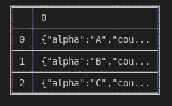
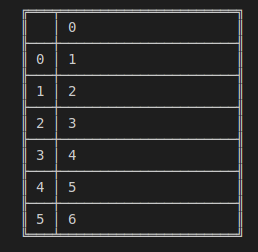
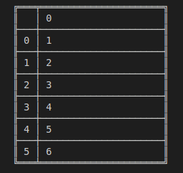

# Series.reset\_index

> danfo.series.reset\_index\(kwargs\) \[[source](https://github.com/opensource9ja/danfojs/blob/master/danfojs/src/core/series.js#L614)\]

Generate a new Series with the index reset. This is useful when the index needs to be treated as a column, or when the index is meaningless and needs to be reset to the default before another operation.

| Parameters | Type | Description | Default |
| :--- | :--- | :--- | :--- |
| kwargs | Object | kwargs is an object {} with key **inplace** with a boolean value. e.g {inplace: false} | inplace:false |

**Returns :** Series

**Example**



```javascript
const dfd = require("danfojs")

let data = [{ alpha: "A", count: 1 }, { alpha: "B", count: 2 }, { alpha: "C", count: 3 }]
let sf = new dfd.Series(data)
let sf_new = sf.set_index({ "index": ["one", "two", "three"] })
let sf_reset = sf_new.reset_index()
sf_reset.print()
```



```

```



**OUTPUT**





```javascript
const dfd = require("danfojs")

let data = [1,2,3,4,5,6]
let sf = new dfd.Series(data)

sf.set_index({ "index": ["one", "two", "three", "four", "five", "six"], "inplace": true })
let sf_reset = sf.reset_index()
sf_reset.print()

```



```

```



**OUTPUT**



Reset index with out returning a new Series



```javascript
const dfd = require("danfojs")

let data = [1,2,3,4,5,6]
let sf = new dfd.Series(data)

sf.set_index({ "index": ["one", "two", "three", "four", "five", "six"], "inplace": true })
sf.reset_index({"inplace":true})
sf.print()
```



```

```



**OUTPUT**



