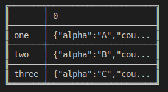
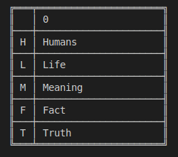
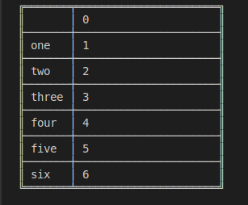

# Series.set\_index

> danfo.series.**set\_index\(**kwargs**\)** \[[source](https://github.com/opensource9ja/danfojs/blob/master/danfojs/src/core/series.js#L635)\]

| Parameters | Type | Description | Default |
| :--- | :--- | :--- | :--- |
| kwargs | Object {} | The object contains the key **index** \[Array\] ****and **inplace** \(boolean\)**.** e.g {index: \[\], inplace:false}. key **index** must be of the same length with the orginal index of the series.  | inplace :false  |

**Returns:** Series

**Example**



```javascript
const dfd = require("danfojs")

let data = [{ alpha: "A", count: 1 }, { alpha: "B", count: 2 }, { alpha: "C", count: 3 }]
let sf = new dfd.Series(data)
let sf_new = sf.set_index({ "index": ["one", "two", "three"] })
sf_new.print()
```



```

```



**OUTPUT**





```javascript
const dfd = require("danfojs")

let data = ["Humans","Life","Meaning","Fact","Truth"]
let sf = new dfd.Series(data)
let sf_new = sf.set_index({ "index": ["H", "L", "M","F","T"] })
sf_new.print()
```



```

```



**OUTPUT**



set index without creating a new series by using `inplace = true`



```javascript
const dfd = require("danfojs")

let data = [1,2,3,4,5,6]
let sf = new dfd.Series(data)
sf.set_index({ "index": ["one", "two", "three", "four", "five", "six"], "inplace": true })
sf.print()
```



```

```



**OUTPUT**



